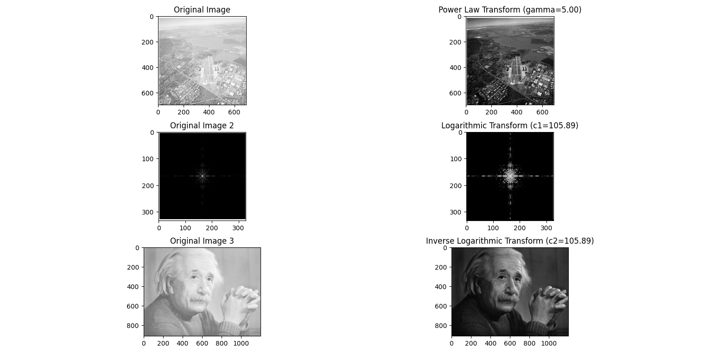

# Digital Image Processing Laboratory

This repository contains the code and documentation for the Digital Image Processing Laboratory assignment. In this assignment, we will work with grayscale images of size 512x512 and perform various image processing operations. Each section below corresponds to a specific task.

## Task 1: Spatial and Intensity Resolution

1. **Decrease Spatial Resolution**
   - Decrease the spatial resolution of a 512x512 grayscale image by half every time.
   - Observe the changes when displaying the image in the same window size.
   #### Sample Output
      

2. **Decrease Intensity Resolution**
   - Decrease the intensity level resolution by one bit up to reach its binary format.
   - Observe the changes when displaying the image in the same window size.
   #### Sample Output
      

3. **Histogram and Thresholding**
   - Illustrate the histogram of the image.
   - Perform single threshold segmentation based on the histogram.
   #### Sample Output
      

## Task 2: Brightness Enhancement

1. **Brightness Enhancement**
   - Perform brightness enhancement on a specific range of gray levels.
   - Observe the results.
   #### Sample Output
      

2. **Transforms Comparison**
   - Differentiate the results of power law transform and inverse logarithmic transform.
   #### Sample Output
      

3. **Difference Image**
   - Find the difference image between the original and the image obtained by keeping the last three bits (most significant bits, MSB).
   #### Sample Output
      

## Task 3: Noise Suppression

1. **Salt & Pepper Noise**
   - Add salt & pepper noise to a grayscale image.
   - Apply average and median spatial filters with a 5x5 mask.
   - Observe their performance for noise suppression in terms of PSNR.
   #### Sample Output
      
   

3. **Varying Filter Size**
   - Use different sizes of masks (3x3, 5x5, 7x7) with an average filter.
   - Observe their performance in terms of PSNR.
   #### Sample Output
      

4. **Mean Filters**
   - Apply harmonic and geometric mean filters on the noisy image.
   - Compare their performance with PSNR.
   #### Sample Output
      

## Task 4: Gaussian Noise and Frequency Domain

1. **Gaussian Noise**
   - Add Gaussian noise to a grayscale image.
   #### Sample Output
      

2. **Frequency Domain Filtering**
   - Apply a 4th order Butterworth and Gaussian low-pass filter.
   - Analyze their performance quantitatively.
   #### Sample Output
      

3. **Ideal Low Pass Filter**
   - Observe the ringing effect of an ideal low-pass filter on the image.
   - Use different radii (D0) of the ideal low-pass filter and display their results.
   #### Sample Output
      

4. **Edge Detection**
   - Perform edge detection on the noisy and clean images using ideal and Gaussian high-pass filters.

## Task 5: Morphological Operations on Binary Images

1. **Erosion and Dilation**
   - Perform erosion and dilation operations on a binary image using a structuring element.
   #### Sample Output
      

2. **Opening and Closing**
   - Perform opening and closing operations on a binary image using a structuring element.
   #### Sample Output
      

3. **Boundary Extraction**
   - Extract the boundary of the binary image using morphological operations.
   #### Sample Output
      

Feel free to explore each section of this repository for code and additional documentation related to the tasks. Have fun with image processing!
